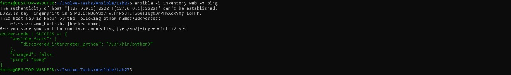
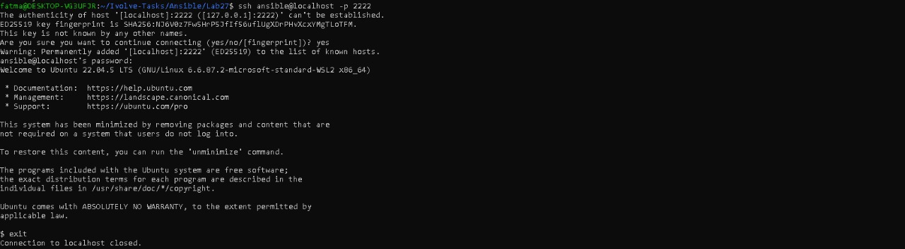
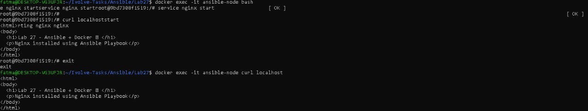

# 🚀 Lab 27: Automated Web Server Configuration Using Ansible Playbooks

This lab demonstrates how to **automate the setup of a web server** using Ansible Playbooks, leveraging a **Docker container** as a managed node and **WSL Ubuntu** as the control node.

---

## 🎯 Lab Objective

Automate the configuration of a web server by performing the following steps:

1. **Managed Node Setup:** Launch a Docker container to act as the target managed node.
2. **Environment Preparation:** Install SSH and Nginx inside the container.
3. **Secure Connectivity:** Configure SSH key-based authentication from the control node.
4. **Inventory Management:** Define the Docker container in an Ansible inventory file.
5. **Playbook Execution:** Use an Ansible Playbook to install, start Nginx, and deploy a custom web page.
6. **Validation:** Verify the web server and custom page from the host machine.

---

## 🏗️ Architecture Overview

- **Control Node:** Ubuntu on WSL with Ansible installed.
- **Managed Node:** Docker container running Ubuntu 22.04, simulating a remote Linux server.
- **Communication:** SSH key-based authentication enables agentless management.

---

## 🧪 Prerequisites

- **WSL Ubuntu:** Control node with Ansible installed.
- **Docker:** To run the managed container.
- **SSH Server:** Installed inside the container.
- **Web Browser / curl:** To verify the deployed web page.

---

## 🛠️ Implementation Steps

### 1. Launch Docker Container

```bash
docker run -dit --name ansible-node -p 2222:22 -p 8080:80 ubuntu:22.04
```

- `-p 2222:22` → SSH access
- `-p 8080:80` → HTTP access to Nginx
- `-dit` → run container in detached interactive mode

---

### 2. Configure Managed Node

```bash
docker exec -it ansible-node bash
apt update
apt install -y openssh-server sudo nginx curl
service ssh start

# Create user for Ansible
useradd -m ansible
passwd ansible
usermod -aG sudo ansible

# Allow passwordless sudo
echo "ansible ALL=(ALL) NOPASSWD:ALL" >> /etc/sudoers
exit
```

---

### 3. Establish SSH Key Authentication

```bash
ssh-keygen -t rsa
ssh-copy-id -i ~/.ssh/id_rsa.pub -p 2222 ansible@localhost
ssh -p 2222 ansible@localhost
```

- Ensures Ansible can connect without entering a password.

---

### 4. Inventory File Configuration

```bash
nano inventory
```

Content:

```ini
[web]
docker-node ansible_host=127.0.0.1 ansible_port=2222 ansible_user=ansible
```

Test connection:

```bash
ansible -i inventory web -m ping
```

- Should return: `pong`

---

### 5. Create Ansible Playbook

```bash
nano webserver.yml
```

Content:

```yaml
---
- name: Configure Web Server using Ansible
  hosts: web
  become: yes

  tasks:
    - name: Install nginx
      apt:
        name: nginx
        state: present
        update_cache: yes

    - name: Start nginx
      shell: "/etc/init.d/nginx start"

    - name: Deploy custom web page
      copy:
        content: |
          <html>
          <body>
            <h1>Lab 27 - Ansible + Docker 🚀</h1>
            <p>Nginx installed and configured using Ansible Playbook</p>
          </body>
          </html>
        dest: /var/www/html/index.html
```

---

### 6. Run Playbook

```bash
ansible-playbook -i inventory webserver.yml
```

- Check that all tasks complete successfully.
- `Install nginx` → should be `ok` or `changed`
- `Start nginx` → uses shell to bypass systemd in Docker

---

### 7. Validate Web Server

- From WSL:

```bash
curl http://localhost:8080
```

- Or open **Chrome**:

```
http://localhost:8080
```

- Expected page:  
> Lab 27 - Ansible + Docker 🚀

---

## ✅ Validation Checklist

- [ ] Docker container launched successfully.
- [ ] Managed node configured with SSH, sudo, Nginx, and curl.
- [ ] SSH key-based authentication works from WSL.
- [ ] Inventory file points to the container with correct port.
- [ ] Playbook executed without errors.
- [ ] Custom web page is accessible on `http://localhost:8080`.

---

## 📸 Screenshots
  




---

## 💡 Key Learnings

- Docker containers can simulate remote managed nodes for lab exercises.
- Ansible’s agentless automation works seamlessly over SSH.
- Handling systemd-less environments requires using `shell` or `service` commands.
- Secure automation via SSH keys avoids manual password prompts.
- Ad-Hoc commands and Playbooks streamline server configuration.

---

## ✨ Author

Fatma Alaa Hassan

