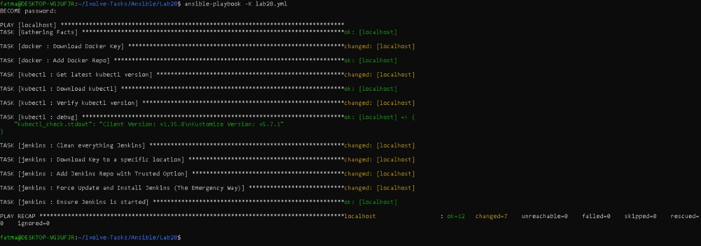
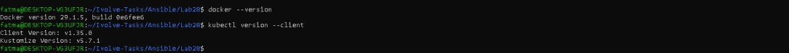
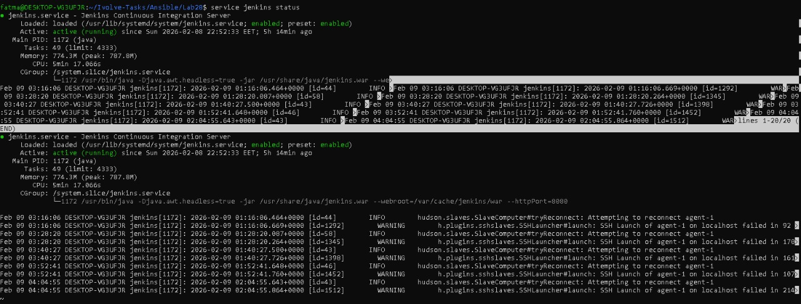

# 🚀 Lab 28: Full DevOps Environment Automation (Docker, Kubectl, & Jenkins)
This lab focuses on automating the installation of a complete DevOps Toolchain on a control node (WSL Ubuntu) using Ansible Roles.
---

## 🎯 Lab Objective
Automate the setup of essential DevOps tools using structured Ansible Roles:

1. **Docker Engine**: Install and configure the Docker runtime for container management.

2. **Kubectl**: Download and set up the Kubernetes command-line tool.

3. **Jenkins**: Automate the installation of Jenkins and Java 17 for CI/CD pipelines.

4. **Role-Based Automation**: Organize tasks into reusable roles (docker, kubectl, jenkins).

---

## 🏗️ Architecture Overview

- **Control Node:** Ubuntu on WSL (Windows Subsystem for Linux).
- **Target:** Localhost (The control node itself acts as the target for environment setup).
- **Automation Engine:** Ansible using Roles for modularity.


---
## 🧪 Prerequisites

**WSL Ubuntu:** Noble (24.04) or Jammy (22.04).

**Ansible:** Installed on the control node.

**Internet Connectivity:** To fetch GPG keys and download packages.

---

## 📂 Project Structure

Lab28/
├── lab28.yml           # Main Playbook
├── roles/
│   ├── docker/         # Docker Installation Role
│   ├── kubectl/        # Kubectl Setup Role
│   └── jenkins/        # Jenkins & Java Setup Role
└── README.md

--- 
## 🛠️ Implementation Highlights

1. Docker Role
Configures the official Docker repository, adds the GPG key to the trusted keyring, and installs the Docker engine.

 2. Kubectl Role
Dynamically fetches the latest stable version of kubectl, downloads the binary, and ensures it has execution permissions in /usr/local/bin.

3. Jenkins Role (Advanced Troubleshooting)
This role handles the specialized GPG key requirements for Jenkins on Ubuntu. It installs OpenJDK 17 (required for Jenkins) and sets up the Jenkins service.

--- 
## 🚀 How to Run

1. Execute the Playbook
Since we are installing system-level packages, we use the ```-K``` flag for sudo privileges:

``` bash 
ansible-playbook -K lab28.yml
```
2. Validation Commands
After the playbook finishes, verify the installations:

Docker:

``` bash 
docker --version
```
Kubectl:

```bash 
kubectl version --client
```

Jenkins:
``` bash 
sudo service jenkins status
```
---
## 📋 Inventory

This lab targets the local machine:

```ini
[local]
localhost ansible_connection=local 
``` 
--- 

## 🌐 Accessing Jenkins
Once installed, Jenkins will be available at: ```http://localhost:8080```

To unlock Jenkins, get the initial admin password:

```bash 
sudo cat /var/lib/jenkins/secrets/initialAdminPassword
```
---

## 💡 Troubleshooting & Key Learnings
During this lab, we encountered and resolved several common DevOps automation challenges:

* GPG Key Conflicts: Resolved ```NO_PUBKEY``` errors by cleaning the legacy ``` trusted.gpg``` and using the modern ```[signed-by=...]``` approach.

* APT Cache Locking: Learned how to manually clear ```/var/lib/apt/lists/``` to resolve cache corruption in WSL.

* Insecure Repositories: Handled repository verification issues using specific APT options to ensure the playbook completes even when WSL environment constraints arise.

* Modular Design: Successfully separated concerns into distinct Roles, making the automation more maintainable

---
## 🧹 Cleanup (Optional)

To remove installed components:
```bash
sudo apt remove -y docker-ce jenkins
sudo rm -rf /var/lib/jenkins
``` 
---

## ✅ Expected Outcome

After successful execution:
- Docker service is installed and running
- kubectl is available system-wide
- Jenkins is accessible on port 8080
- Jenkins service starts automatically on boot
---

## 📸 Screenshots
  




--- 

## ✨ Author

Fatma Alaa Hassan