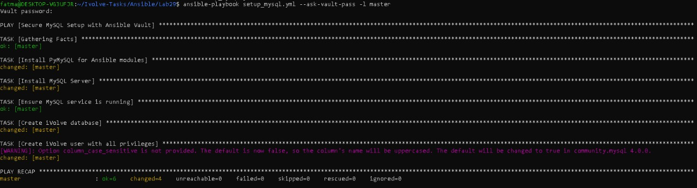
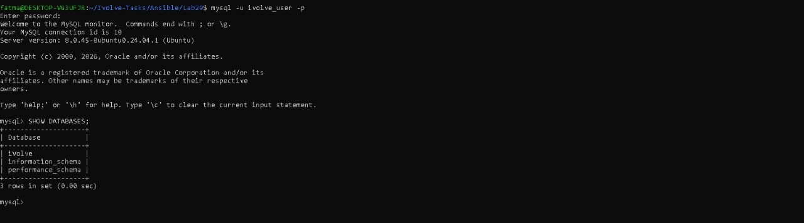

# 🔐 Lab 29: Securing Sensitive Data with Ansible Vault
This lab focuses on automating the installation of MySQL Server and managing sensitive database credentials securely using Ansible Vault.

---

## 🎯 Lab Objective

* Automate database provisioning while maintaining high security standards:

*MySQL Installation: Automated setup of the MySQL database engine.

* Database Creation: Automatically provision a database named iVolve.

* Secure User Management: Create a database user with full privileges.

* Data Encryption: Use Ansible Vault to encrypt the database password, ensuring no sensitive data is stored in plain text.

--- 

## 🏗️ Architecture Overview

**Control Node**: Ubuntu on WSL (Windows Subsystem for Linux).

**Target Node**: Localhost / Managed Nodes (Defined in Inventory).

**Security Layer**: AES-256 encryption via Ansible Vault.

---

## 📂 Project Structure

``` plaintext
Lab29/
├── setup_mysql.yml    # Main Playbook
├── secrets.yml        # Encrypted Vault file (Passwords)
├── inventory             # Inventory file
└── README.md          # Documentation

```
--- 
## 🛠️ Implementation Highlights

1. Ansible Vault Integration
Instead of writing the password directly in the playbook, we use an encrypted variables file:

- Command to create: ```ansible-vault create secrets.yml```

- Variable inside: ```db_password: "YourPassword"```

2. PyMySQL Dependency
To allow Ansible's ```mysql_db``` and ```mysql_user``` modules to interact with the database, the ```python3-pymysql``` package is installed as a prerequisite within the playbook.

3. Privilege Management
The playbook ensures the user ```ivolve_user``` has ```ALL``` privileges on the ```iVolve``` database specifically, following the principle of least privilege where applicable.

---

## 🚀 How to Run
1. Execute the Playbook
You must provide the Vault password to allow Ansible to decrypt the sensitive variables:

```bash
ansible-playbook setup_mysql.yml --ask-vault-pass
```
2. Validation Steps
After the playbook finishes, verify the setup manually:

Login to MySQL:
```bash
mysql -u ivolve_user -p
```
Verify Database:

```sql
SHOW DATABASES;
```
---

## 📋 Inventory Example

```bash
[servers]
master ansible_host=127.0.0.1 ansible_connection=local
```
---

## 💡 Troubleshooting & Key Learnings
Socket Errors: Resolved ``` Can't connect to local MySQL server``` by ensuring the MySQL service is started and using ``` login_unix_socket ```.

Vault Editing: Learned to use ``` ansible-vault edit secrets.yml``` to update encrypted credentials safely.

Python Libraries: Identified that Ansible requires ``` python3-pymysql``` on the target node to execute database tasks.

Task Ordering: Ensuring the MySQL service is ```started``` before attempting to create databases or users.

---
## ✅ Expected Outcome
MySQL Server is installed and running.

A database named ```iVolve``` is created.

An encrypted password is used to create ```ivolve_user```.

No sensitive passwords are visible in the source code

---
## 📸 Screenshots
  




--- 

## ✨ Author

Fatma Alaa Hassan
